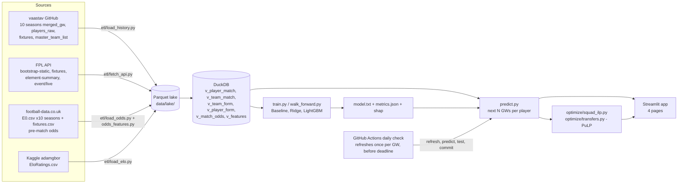

# FPLense: build plan

A Fantasy Premier League points forecaster and squad optimizer: an ETL pipeline, SQL feature store, gradient-boosted forecast, integer-programming optimizer and a live app.

> Target: a strong final-year student, about 2.5–3 weeks part-time (roughly 14.5 working sessions of about 3 hours each), split into **6 phases** (§7).
> Deadline: the resume entry is dated **Nov 2026**, so all 6 phases ship (public URL + measured metrics) by **30 Nov 2026**.
> Machine: Windows for development. Deployment runs on GitHub Actions and Streamlit Community Cloud (both free).
> Data: 4 free public sources: FPL history (GitHub), the live FPL API, bookmaker odds (football-data.co.uk) and club Elo ratings (a Kaggle dataset). See the "Data at a glance" table in §3.


---

## 0. Before you start (read this first, especially if an AI coding agent is building this)

### 0.0 Phase status

Update this table at the end of every phase (see `CLAUDE.md` → "Implementing a phase"). Phase notes go in `PROGRESS.md`.

| Phase | Name | Sessions | Status | Finished | Key result |
|---|---|---:|---|---|---|
| P1 | Setup + historical ETL | 2 | ✅ done | 2026-10-07 | 10 seasons in lake: 253,900 raw → 253,578 rows (322 AM rows dropped); 3,800 fixtures; schema tests green |
| P2 | Odds/Elo ETL + DuckDB feature store | 2.5 | ⬜ not started | | |
| P3 | EDA + baselines + LightGBM walk-forward | 3.5 | ⬜ not started | | |
| P4 | SHAP + model card + PuLP optimizer + transfer planner | 3 | ⬜ not started | | |
| P5 | Live API path + predictions + Streamlit app | 2 | ⬜ not started | | |
| P6 | GitHub Actions + deploy + README | 1.5 | ⬜ not started | | |

Status values: ⬜ not started · 🟨 in progress · ✅ done · ⚠️ done with deferrals (listed in `PROGRESS.md`).

### 0.1 Rules for building

1. **One phase per run.** Build phases in order (P1 → P6). Don't start a phase until the previous one's "Done when" list (§8) is green or its deferrals are written down in `PROGRESS.md`.
2. **Ask first, then build the whole phase in one pass.** Clarifying questions come up front; after that the entire phase (all modules, SQL, tests, notebooks and app pages listed for it) is implemented without stopping for per-file verification.
3. **Tests before code, never weakened.** Write the tests named in each phase alongside or before the code they test. Never skip, `xfail` or loosen a test to make it pass.
4. **Run the checks before finishing:** `ruff check .`, `ruff format --check .` and `pytest -q`. Fix failures. Don't launch the Streamlit app or long-running servers; the developer does that by hand.
5. **Numbers in §3 are sanity checks, not values to hard-code.** If outputs don't match, find out why and record it in `DECISIONS.md`.
6. **Never commit data or secrets** (§0.3).

### 0.2 Kaggle account and API token
Only one source needs Kaggle: the Elo ratings (`adamgbor/club-football-match-data-2000-2025`). The FPL history (GitHub), the FPL API and football-data.co.uk need no account.
1. Create a free account at https://www.kaggle.com and verify your phone number (some downloads require it).
2. Go to Kaggle → your profile → **Settings** → **API** → **Create New Token**. This downloads `kaggle.json`.
3. Put it at `%USERPROFILE%\.kaggle\kaggle.json` on Windows (`~/.kaggle/kaggle.json` on Linux/macOS, `chmod 600`). For CI, set the `KAGGLE_USERNAME` and `KAGGLE_KEY` environment variables or GitHub Actions secrets instead.
4. `pip install kaggle`, then test with `kaggle datasets list -s football`.
5. On some datasets, open the dataset page once in the browser and accept any terms before the API will download it.
6. **Never commit `kaggle.json` or the key.** Add `kaggle.json`, `.env`, `data/raw/`, `data/lake/` and `data/*.duckdb` to `.gitignore` on day 1.
7. The download script must fail with a clear message ("Kaggle token not found: see PLAN.md §0.2") instead of a stack trace.

### 0.3 Licences: never commit raw data

| Source | Licence / terms | What it means here |
|---|---|---|
| vaastav/Fantasy-Premier-League (GitHub) | Public repo; cite as its README asks | Credit it; don't re-host the full dataset |
| Official FPL API | Unofficial, undocumented; personal/non-commercial use | Cache politely, keep request rates low, no commercial use |
| football-data.co.uk | Free; attribute the site | Credit it; don't re-host the CSVs |
| Club Football Match Data (`adamgbor/...`, Kaggle) | MIT | Permissive, but still credit it |

Committing your small **published predictions** (`data/published/`) is fine: they are your model's output, not the source data.

Rules for the repo:
- `data/raw/`, `data/lake/` and the DuckDB file are gitignored. Ship download scripts (`src/fPLense/etl/load_history.py`, `load_odds.py`, `load_elo.py`) that fetch everything reproducibly and record file hashes.
- Your **code** is MIT. Say in the README that the data is not covered by the code licence.
- The README has a **Data credits** table: dataset name, link, author, licence, and what it was used for.

### 0.4 Keep the resume true
The resume entry this project backs is in §10. It was written before the project was built.
- Don't rename the project, its repo (`github.com/SudevOP1/FPLense`) or the headline tech stack (**Python, DuckDB, LightGBM, scikit-learn, SHAP, PuLP, Streamlit**) without updating the resume too.
- Every number in §10 is either a **design fact** you must actually build (250K+ rows, 10 seasons, 30+ features, £100m / quotas / 3-per-club) or a **VERIFY** number you must measure (the ~10% MAE cut; see §9). After building, replace targets with measured values; never the other way round.
- The same project also appears as a compact entry on the ML resume, with the same ~10% MAE target. Keep the two resumes' numbers identical.
- The resume says "refreshed weekly by GitHub Actions". The workflow runs a daily check that only refreshes once per gameweek (i.e. roughly weekly, before each deadline). That matches the claim; don't change it to a plain weekly cron that can miss midweek deadlines.

### 0.5 Practical notes
- Keep a short `DECISIONS.md` (what you chose and why). Interviewers will ask, and you need to be able to explain every line you ship.
- **Markdown formatting:** if your editor auto-formats Markdown (e.g. Prettier on save), it can mangle names with double underscores in tables. Keep code identifiers inside backticks, or turn off format-on-save for `.md` files.

---

## 1. Pitch (one paragraph)

FPLense predicts how many FPL points every Premier League player will score in the next gameweeks and then picks the mathematically best squad. A Python ETL merges **10 seasons of historical player-gameweek data (250K+ rows)** with the **official FPL API**. **DuckDB SQL window-function views** build 30+ leakage-safe features (rolling form, minutes, xG/xA, fixture difficulty, and opponent strength from team form, **pre-match bookmaker odds and club Elo ratings**). A **LightGBM regressor**, validated **walk-forward like a real forecast** against a rolling-form baseline and a Ridge regression, produces the predictions, and **SHAP** explains each one. A **PuLP integer linear program** then picks the best 15-man squad under the £100m budget, position quotas and the 3-per-club rule, and a transfer planner recommends moves. A **Streamlit** app shows all of it, and **GitHub Actions** refreshes it before every gameweek deadline. It's a full DS loop: framing, data, features, validation, explainability, a decision layer and deployment.

## 2. Why it matters for DS / DA hiring

| What current JDs ask for | Where FPLense proves it |
|---|---|
| Python, pandas, NumPy, SQL | ETL in pandas, feature views in DuckDB SQL with window functions |
| Machine learning, scikit-learn, gradient boosting | Ridge (scikit-learn) and LightGBM, with hyperparameters and early stopping |
| Feature engineering, leakage awareness | 30+ lagged features plus an automated **no-leakage test** |
| Time-series forecasting and validation | Expanding-window walk-forward CV by gameweek, plus a season holdout |
| Model evaluation / statistics | MAE, RMSE, Spearman rank correlation, top-k precision, calibration, bootstrap CIs |
| Explainability | SHAP global (beeswarm) and local (waterfall per player) |
| Optimization / decision science | Integer linear program (PuLP + CBC) and a transfer recommender with hit costs |
| Data visualization, dashboards | Matplotlib/Seaborn EDA, Plotly charts in Streamlit |
| ETL, automation, deployment, Git | Scheduled GitHub Actions refresh, pytest, Streamlit Cloud |

RetailPulse shows the analyst/BI half. FPLense shows the modelling half and gives you a **live link** recruiters can click.

## 3. Data: sources and verified facts

### Data at a glance

| # | Dataset | Where | Licence / terms | Role | How I checked it (2026-10-07) |
|---|---|---|---|---|---|
| 1 | **vaastav/Fantasy-Premier-League** | GitHub: https://github.com/vaastav/Fantasy-Premier-League | Public repo; cite it as its README asks | **Training data.** 10 seasons of per-fixture FPL player rows (253,900) | Downloaded every season and counted (§3a) |
| 2 | **Official FPL API** | `fantasy.premierleague.com/api/…` (no key) | Unofficial and undocumented; personal/non-commercial use | **Live data** for 2026-27: current history, prices, availability, fixtures | Endpoint list cross-checked; fields to confirm in P1 (§3b) |
| 3 | **football-data.co.uk Premier League CSVs** | `https://www.football-data.co.uk/mmz4281/<season>/E0.csv` (e.g. `2526`) and `https://www.football-data.co.uk/fixtures.csv` for upcoming matches | Free; attribute the site | Pre-match bookmaker odds → implied team goals and clean-sheet probability | Fetched every season file and counted rows and odds columns (§3e) |
| 4 | **Club Football Match Data (2000–2025)** | Kaggle `adamgbor/club-football-match-data-2000-2025` | MIT | ClubElo team ratings (`EloRatings.csv`) | Kaggle metadata and column stats checked (§3e) |

Why not a Kaggle FPL dataset for training? I checked the active ones (§3f). They are season-to-date snapshots, not per-gameweek history, so the vaastav repo stays the training source.

### 3a. Historical data: `vaastav/Fantasy-Premier-League`
Repo: https://github.com/vaastav/Fantasy-Premier-League (data in `data/<season>/`, a `DATA_DICTIONARY.md` at the root). Citation info is in the repo README; cite it.

I verified these on 2026-10-07 by downloading every `data/<season>/gws/merged_gw.csv` from raw.githubusercontent.com:

| Season | Rows in `merged_gw.csv` | Notes |
|---|---:|---|
| 2016-17 | 23,679 | no `position`/`team` columns; **no `fixtures.csv`** (so no FDR); no `teams.csv` |
| 2017-18 | 22,467 | same as 2016-17 |
| 2018-19 | 21,790 | `fixtures.csv` with `team_h_difficulty`/`team_a_difficulty` from here onward |
| 2019-20 | 22,560 | **GW numbers jump 29 → 39** (COVID restart); remap GW 39–47 to 30–38 |
| 2020-21 | 24,365 | `position`, `team`, `xP` columns appear |
| 2021-22 | 25,447 | |
| 2022-23 | 26,505 | **`expected_goals`, `expected_assists`, `expected_goal_involvements`, `expected_goals_conceded`, `starts` from here** |
| 2023-24 | 29,725 | |
| 2024-25 | 27,605 | adds `mng_*` columns (that season's assistant-manager chip; drop them) |
| 2025-26 | 29,757 | **`defensive_contribution`, `clearances_blocks_interceptions`, `recoveries`, `tackles`** (DEFCON scoring began this season) |
| **Total, 10 complete seasons** | **253,900** | 108,687 rows (42.8%) have minutes > 0 |
| 2026-27 (in progress) | 610 (GW1 only) | The repo now updates only at season start, in January and at season end, **so in-season data must come from the API** |

More facts:
- Rows are **per fixture**, not per gameweek. In a double gameweek a player has 2 rows; in 2024-25 there are 27,605 rows but 27,231 unique player-GW pairs.
- `element` IDs **change every season**. Identity is per season (join on season + element).
- For older seasons, get position and team from `data/<season>/players_raw.csv` (`element_type`: 1=GK, 2=DEF, 3=MID, 4=FWD; `team`). Team names for all seasons are in `data/master_team_list.csv` (season, team, team_name).
- **`xP` is FPL's own expected-points figure.** The repo README warns it can leak look-ahead information, so **exclude it**.
- Points scale: mean ≈ 2.7–3.0 points per appearance, SD ≈ 2.9 (2024-25, 2025-26). It's noisy, so keep metric expectations modest.

### 3b. Live data: official FPL API (no key needed; send a browser-like `User-Agent`)
| Endpoint | Use |
|---|---|
| `https://fantasy.premierleague.com/api/bootstrap-static/` | players (`elements`: id, web_name, team, element_type, now_cost, status, chance_of_playing_next_round, selected_by_percent, ep_next), teams (strength_* ratings), events (deadlines, `is_next`) |
| `https://fantasy.premierleague.com/api/fixtures/` (`?event=GW`) | all fixtures with `team_h_difficulty` / `team_a_difficulty` |
| `https://fantasy.premierleague.com/api/element-summary/{id}/` | `history` (this season's per-fixture rows, same fields as vaastav), `fixtures` (upcoming), `history_past` (previous-season totals, for cold-start features) |
| `https://fantasy.premierleague.com/api/event/{gw}/live/` | all players' stats for one GW in one call (cheaper refresh) |
| `https://fantasy.premierleague.com/api/entry/{team_id}/event/{gw}/picks/` | a public team's 15 picks, for the transfer planner |

The API is undocumented and can change, so wrap every call in retries and schema checks. **Confirm the response fields in P1** and save samples to `tests/fixtures/`.

### 3c. Game rules the optimizer must encode (2026/27)
- £100.0m budget; a squad of **2 GK, 5 DEF, 5 MID, 3 FWD**; **at most 3 players per club**.
- Starting XI: 1 GK, ≥3 DEF, ≥2 MID, ≥1 FWD. The captain scores double.
- 1 free transfer per GW, rolling over to a maximum of 5. Each extra transfer costs **−4 points**. When selling, you get back only 50% of any price rise.
- Defensive contributions: DEF earn 2 points for 10 CBIT; MID/FWD earn 2 points for 12 CBIRT, capped at 2 per match. These have scored since 2025-26.
- **New in 2026/27:** BPS changes (no penalty for being tackled, +1 BPS per 3 CBI instead of 2, more BPS for goalkeeper saves). This is a **distribution shift** for bonus points. Monitor residuals by position this season and mention it in interviews.
- Two chip sets per season. Chips are out of scope for v1 (see stretch goals).

**Re-read the official FPL "Help → Rules" page before you hard-code anything.**

### 3d. Sanity check I ran (so your targets are realistic)
Setup: an untuned sklearn `HistGradientBoostingRegressor`, about 26 lagged form features (no fixture or opponent features yet), trained on 2022-23 to 2024-25 and tested on 2025-26 GW5+ (the same season, not walk-forward). The baseline is the mean of the last 5 appearances.

| Subset | Model | MAE | RMSE | Spearman |
|---|---|---:|---:|---:|
| All rows (n=26,804) | rolling-5 baseline | 1.03 | 2.08 | 0.72 |
| | GBM (L2 loss) | 0.99 | 1.94 | 0.72 |
| **Regulars** (avg ≥45 min over the previous 3, n=7,475) | rolling-5 baseline | **2.51** | 3.32 | 0.16 |
| | GBM (L2 loss) | **2.24 (−11%)** | 3.07 | 0.24 |
| | GBM (L1 loss) | 2.09 (−17%) | 3.37 | 0.23 |

Takeaways:
1. **Report on regulars.** On all rows, zero-minute players make every model look good (Spearman 0.72).
2. **A ~10% MAE gain over the baseline is a realistic target** (this is the resume's headline number). Fixture and opponent features plus tuning should hold or improve it, but report what you get.
3. **L1 loss wins on MAE but loses on RMSE.** It predicts the median, which under-rates hauls. The optimizer needs *expected* points, so use **L2 for the optimizer** and report both.

### 3e. Bookmaker odds and Elo team ratings (opponent strength)

**Why add these.** Backward-looking opponent features (`opp_ga_r5`, `opp_xga_r5`, FDR) are noisy over 5 matches. Bookmaker prices are the market's forward-looking view of a fixture, priced in before the deadline. Converted into each team's expected goals and clean-sheet probability, they are among the most predictive pre-match signals for attacking returns and DEF/GK clean sheets. Elo adds a stable, slow-moving measure of team strength that also covers seasons where FPL has no xG. On the resume these all sit under "opponent strength".

**Source A: football-data.co.uk (odds).** One CSV per Premier League season. I fetched each file on 2026-10-07:

| Seasons | Rows | Pre-match odds columns present | Over/under 2.5 columns | Notes |
|---|---:|---|---|---|
| 2016-17, 2017-18, 2018-19 | 380 each | `B365H/D/A`, `PSH/D/A` (Pinnacle), Betbrain averages `BbAvH/D/A` | `BbAv>2.5`, `BbAv<2.5` | Date format `dd/mm/yy` in 2016-17, `dd/mm/yyyy` after; no kick-off `Time` column |
| 2019-20 → 2024-25 | 380 each | `B365H/D/A`, `PSH/D/A`, market average `AvgH/D/A`, max `MaxH/D/A` | `Avg>2.5`, `Avg<2.5`, `B365>2.5` | `Time` column added |
| 2025-26 | 380 | as above, but **Pinnacle (`PSH`) only for 210 of 380** | full | Use the market average, not Pinnacle |
| 2026-27 (in progress) | 50 (up to 20 Sep 2026) | `B365*`, `Avg*` (no Pinnacle) | full | Updated during the season; lags a few days |

- **Odds timing (from the site's `notes.txt`):** "Betting odds for weekend games are collected Friday afternoons, and on Tuesday afternoons for midweek games." These pre-closing odds are what you use. The **closing odds** columns (with a `C`, e.g. `AvgCH`, `B365C>2.5`) are taken at kick-off, after the FPL deadline. **Never use them as features; that would be leakage.**
- **Upcoming matches:** `https://www.football-data.co.uk/fixtures.csv` lists the next round's matches with the same odds columns. Filter `Div == "E0"`. On 2026-10-07 it had no Premier League rows (international break), so the live path needs a fallback (see P5).
- Fallback order per match: market average (`Avg*`, or `BbAv*` before 2019-20), then Bet365 (`B365*`).

**Source B: Kaggle `adamgbor/club-football-match-data-2000-2025` (Elo).** MIT licence, updated monthly.
- `EloRatings.csv`: dated ClubElo snapshots (`Date`, `Club`, `Country`, `Elo`).
- Take each team's rating from the latest snapshot dated **strictly before** the match date, using a DuckDB `ASOF JOIN` (a nice SQL feature to mention in interviews).
- `Matches.csv` (Premier League is `E0`) mirrors Source A but updates more slowly; use Source A for odds.

**Turning odds into features** (`etl/odds_features.py`, about 40 lines with SciPy):
1. **Remove the bookmaker margin (de-vig):** `p_i = (1/o_i) / Σ_j (1/o_j)` for home/draw/away, and the same for over/under 2.5.
2. **Implied total goals μ:** solve `1 − e^(−μ)(1 + μ + μ²/2) = p_over2.5` with `scipy.optimize.brentq` (μ between 0.2 and 6).
3. **Split μ into λ_home and λ_away:** with independent Poisson goals, solve for the share `s` such that `P(Skellam(sμ, (1−s)μ) > 0) = p_home`, using `scipy.stats.skellam` and `brentq` (s between 0.05 and 0.95).
4. **Per team per fixture:** `team_xg_implied = λ_own`, `opp_xg_implied = λ_opp`, `p_clean_sheet = exp(−λ_opp)`, `p_win`, and `elo_diff = own Elo − opponent Elo`.
5. **Sanity check:** across a season, mean `p_clean_sheet` should be close to the actual clean-sheet rate (about 0.25–0.30). Plot predicted vs actual by decile.

**Joining to FPL fixtures.** Each home–away pair occurs once per season, so **(season, home team, away team) is a unique key**. You need a name-mapping table (`src/fPLense/etl/team_names.csv`): football-data uses `Man United`, `Nott'm Forest`, `Sheffield United`; FPL uses `Man Utd`, `Nott'm Forest`, `Sheffield Utd`, `Spurs`; ClubElo uses names like `Forest`. `test_team_name_map.py` asserts **3,800 of 3,800** historical fixtures (2016-17 to 2025-26) match, and that every 2026-27 club maps (including promoted clubs such as `Coventry`).

### 3f. Kaggle FPL datasets I checked, and why they're not the training source

| Kaggle dataset | What it is | Verdict |
|---|---|---|
| `calvinrostanto/fantasy-premier-league-2025-2026` ("FPL 26/27") | One CSV refreshed daily from the FPL API | A season-to-date **snapshot**, not per-gameweek rows. Backup for current prices only if the API blocks the Actions runner |
| `meraxes10/fantasy-premier-league-dataset-2025-2026` and `-2026-2027` | Player snapshots (CC0 / Apache 2.0) | Same: no per-fixture history |
| `reevebarreto/fantasy-premier-league-player-data-2016-2024` | Gameweek data 2016–2024 | Stale and derived from vaastav anyway |

## 4. Tech stack

| Layer | Tool | Notes |
|---|---|---|
| ETL | Python 3.12, `requests` (with retry/backoff), pandas, pyarrow | Raw JSON/CSV → Parquet in `data/lake/` |
| Feature store | **DuckDB** (embedded, file `data/fplense.duckdb`) | SQL views with window functions; reads Parquet directly |
| Modelling | scikit-learn (Ridge, pipelines, metrics), **LightGBM**, SciPy, NumPy | LightGBM handles NaN natively, which matters for missing xG and DEFCON in old seasons |
| Explainability | **SHAP** (`TreeExplainer`) | |
| Optimization | **PuLP 3.x** with its bundled **CBC** solver | **Pin `pulp>=3.3,<4`.** PuLP 3.x bundles CBC (Windows included) and keeps the classic `LpVariable.dicts` API. PuLP 4.0 dropped both (on 4.x: `pip install highspy`, `m.add_variable_dict(...)`, `pulp.HiGHS(msg=False)`) |
| EDA / reporting | Jupyter, Matplotlib, Seaborn | |
| App | **Streamlit** + Plotly | Deployed on Streamlit Community Cloud from GitHub |
| Automation | **GitHub Actions** (cron + manual dispatch) | Commits refreshed predictions to `data/published/` |
| Quality | pytest, ruff | Leakage test, optimizer-constraint tests, ETL schema tests |

## 5. Architecture



## 6. Repository structure

```
FPLense/
├── README.md  PLAN.md  PROGRESS.md  DECISIONS.md  CLAUDE.md  LICENSE
├── requirements.txt          # pandas pyarrow duckdb requests lightgbm scikit-learn scipy shap "pulp>=3.3,<4"
│                             # streamlit plotly matplotlib seaborn kaggle jupyter pytest ruff
├── pyproject.toml            # package "fPLense" (src layout), ruff + pytest config
├── .github/workflows/refresh.yml
├── src/fPLense/
│   ├── config.py             # seasons, paths, FEATURES list, horizon, bench weight
│   ├── etl/
│   │   ├── load_history.py   # download vaastav CSVs → normalize → parquet
│   │   ├── normalize.py      # GW remap 2019-20, position/team joins, column harmonisation
│   │   ├── fetch_api.py      # bootstrap-static, fixtures, element-summary (cached), picks
│   │   ├── load_odds.py      # football-data E0.csv per season + fixtures.csv → parquet
│   │   ├── odds_features.py  # de-vig, implied goals (Poisson/Skellam), clean-sheet prob
│   │   ├── load_elo.py       # Kaggle adamgbor EloRatings.csv → parquet (kaggle API)
│   │   └── team_names.csv    # FPL ↔ football-data ↔ ClubElo club names
│   ├── db/
│   │   ├── build.py          # creates the DuckDB file and runs sql/*.sql in order
│   │   └── sql/  01_v_player_match.sql  02_v_team_match.sql  03_v_team_form.sql
│   │             04_v_player_form.sql   05_v_match_odds.sql  06_v_features.sql
│   ├── models/
│   │   ├── baselines.py      # rolling-5 mean, Ridge pipeline
│   │   ├── train.py          # LightGBM with early stopping
│   │   ├── walk_forward.py   # expanding-window CV by gameweek
│   │   ├── evaluate.py       # MAE/RMSE/Spearman/top-k, bootstrap CI, plots
│   │   ├── explain.py        # SHAP values, beeswarm, waterfalls
│   │   └── predict.py        # next-N-GW expected points per player
│   ├── optimize/
│   │   ├── squad_ilp.py
│   │   └── transfers.py
│   └── pipeline.py           # CLI: --refresh --build --train --predict --horizon N
├── app/
│   ├── Home.py
│   └── pages/  1_Projections.py  2_Optimal_Squad.py  3_Transfer_Planner.py  4_Model_Card.py
├── notebooks/  01_eda.ipynb  02_model_eval.ipynb  03_shap.ipynb  04_optimizer_backtest.ipynb
├── tests/      test_etl_schema.py  test_team_name_map.py  test_odds_features.py  test_no_leakage.py
│               test_baselines.py  test_walk_forward.py  test_squad_constraints.py  test_transfers.py
│               test_fetch_api.py  test_predict.py   fixtures/ (saved API samples)
├── data/
│   ├── raw/  lake/  fplense.duckdb   (all gitignored)
│   └── published/   predictions_gwXX.parquet, squad_gwXX.json, metrics.json, model.txt  (small, committed)
└── docs/        model_card.md  img/
```

Tests that need the downloaded lake (row counts, the 3,800-fixture join, leakage rebuild) are marked `@pytest.mark.data` and **skip with a clear reason** when `data/lake/` is missing, so CI and fresh clones still pass on the pure-logic tests. `pytest -q -m data` runs them locally.

## 7. Phases

| Phase | Covers | Sessions (~3h) | Cumulative | Target dates (2026) | Done when (summary) |
|---|---|---:|---:|---|---|
| **P1** | Setup, API exploration, historical ETL | 2 | 2 | Oct 8 – Oct 14 | 10 seasons in Parquet, 253,900 rows, schema test green |
| **P2** | Odds + Elo ETL, team-name map, DuckDB feature views | 2.5 | 4.5 | Oct 15 – Oct 24 | 3,800/3,800 fixtures matched; `v_features` with 30+ features; **leakage test green** |
| **P3** | EDA, baselines, LightGBM, walk-forward evaluation | 3.5 | 8 | Oct 25 – Nov 5 | metrics table for 2025-26 GW5–38 with bootstrap CI; **measured MAE gain** |
| **P4** | SHAP, model card, squad ILP, transfer planner, backtest | 3 | 11 | Nov 6 – Nov 14 | beeswarm + waterfalls, `model_card.md`, constraint tests green |
| **P5** | Live API path, predictions, 4-page Streamlit app | 2 | 13 | Nov 15 – Nov 22 | 4 pages working locally on 2026-27 data |
| **P6** | GitHub Actions, deploy, README | 1.5 | 14.5 | Nov 23 – Nov 30 | public URL, one scheduled run succeeded, README complete |

If time runs short, cut in this order: the backtest (P4), the transfer planner page (P5; keep `transfers.py` and its tests, since the resume names the planner, so ship at least a minimal page), the EDA chart count (P3). **Never cut the walk-forward evaluation, the leakage test or the squad ILP.** These back the resume.

## 8. Phase-by-phase tasks

### P1: Setup, API exploration and historical ETL (2 sessions)

**Build**
1. **Repo and tooling.** Repo **SudevOP1/FPLense** (the resume link points here). `pyproject.toml` (src layout, package `fPLense`, ruff config, pytest markers incl. `data`), `requirements.txt` (§6), `.gitignore` (§0.2), `LICENSE` (MIT), empty `DECISIONS.md`. `config.py` holds seasons (`2016-17` … `2025-26`, current `2026-27`), paths and the request settings.
2. **API exploration.** A small script/notebook calls `bootstrap-static`, `fixtures`, `element-summary/{id}` and `event/1/live` with `headers={"User-Agent": "Mozilla/5.0 FPLense"}` and `time.sleep(0.25)` between calls. Save trimmed samples to `tests/fixtures/` and write the real field names into `DECISIONS.md`.
3. **`load_history.py`.** For each of the 10 seasons, download `gws/merged_gw.csv` and `players_raw.csv` (plus `fixtures.csv` from 2018-19 onward and the root `master_team_list.csv`) into `data/raw/`. Read with `encoding="latin-1"`. Record SHA-256 hashes in `data/raw/manifest.json`. Skip files already downloaded unless `--force`.
4. **`normalize.py`.**
   - Remap 2019-20 `GW` values 39–47 to 30–38.
   - Join `players_raw` (season, `id`) to get `element_type` → `position` and `team` (id → name via `master_team_list`) for seasons without those columns.
   - Harmonise columns to one schema. Columns missing in a season (xG before 2022-23, DEFCON before 2025-26, `starts`) become NaN, **not 0**.
   - Derive `team_score`/`opp_score` from `was_home`, `team_h_score` and `team_a_score`.
   - Price = `value / 10`.
   - Drop `xP`, `mng_*`, `kickoff_time_formatted`, `ea_index`, `loaned_in/out`.
5. Write `data/lake/player_match/season=YYYY-YY/part.parquet`.
6. `pipeline.py --refresh-history` wires it up.

**Tests:** `test_etl_schema.py`: pure-logic tests on small in-memory frames (GW remap, NaN-not-0 for missing columns, score derivation, dropped columns) plus `@data` tests: per-season row counts equal §3a (total 253,900); required columns exist; `position` in {GK, DEF, MID, FWD} with no nulls; GW in 1..38.

**Done when:** 10 seasons in Parquet, 253,900 rows, schema tests green, API fields recorded.

### P2: Odds + Elo ETL and DuckDB feature store (2.5 sessions)

**Build — odds and Elo**
1. `load_odds.py`: for seasons `1617` … `2526` (and `2627` in season), download `https://www.football-data.co.uk/mmz4281/<season>/E0.csv`. Parse `Date` with `dayfirst=True`. Keep `HomeTeam, AwayTeam, FTHG, FTAG` plus pre-match odds in the §3e fallback order. **Drop every closing-odds column** (any bookmaker or Max/Avg prefix followed by `C`, e.g. `B365CH`, `AvgC>2.5`) at load time. Assert 380 rows per completed season. Write `data/lake/odds/season=…/part.parquet`.
2. `load_elo.py`: `kaggle datasets download -d adamgbor/club-football-match-data-2000-2025 -f EloRatings.csv`; keep `Country == "ENG"` from 2016-07-01 onward. Clear error if the token is missing (§0.2).
3. `team_names.csv`: `fpl_name`, `fd_name`, `clubelo_name` for every club in the 10 seasons plus 2026-27 (about 35 rows), built from distinct names in each source.
4. `odds_features.py`: the §3e steps (de-vig, solve μ, split into λ_home/λ_away, clean-sheet probability).
5. Calibration plot `docs/img/odds_cs_calibration.png`: implied clean-sheet probability deciles vs actual clean-sheet rate. If badly off, check de-vig and home/away orientation.

**Build — DuckDB views** (`db/build.py` creates `data/fplense.duckdb` and runs `sql/*.sql` in order; `pipeline.py --build`)

Every rolling window **ends at `1 PRECEDING`**, so a row only sees fixtures that came before it. Windows reset each season (`PARTITION BY season, element`).

- `01_v_player_match.sql` reads the Parquet lake: one row per player-fixture.
- `02_v_team_match.sql`: one row per (season, fixture, team): goals_for, goals_against, xg_for (Σ player xG), xg_against (opponent's xg_for), is_home, kickoff_time, gw.
- `03_v_team_form.sql`:
```sql
create or replace view v_team_form as
select *,
  avg(goals_for)     over w5 as team_gf_r5,
  avg(goals_against) over w5 as team_ga_r5,
  avg(xg_for)        over w5 as team_xgf_r5,
  avg(xg_against)    over w5 as team_xga_r5,
  count(*) over (partition by season, team, gw) as team_fixtures_in_gw   -- DGW flag
from v_team_match
window w5 as (partition by season, team order by kickoff_time
              rows between 5 preceding and 1 preceding);
```
- `04_v_player_form.sql` (excerpt):
```sql
create or replace view v_player_form as
select season, element, fixture, gw, kickoff_time, position, team, opponent_team, was_home, price,
       total_points as y,                                         -- target (this fixture)
  lag(total_points) over p                         as pts_last1,
  avg(total_points) over (p rows between 3 preceding and 1 preceding) as pts_r3,
  avg(total_points) over (p rows between 5 preceding and 1 preceding) as pts_r5,
  avg(total_points) over (p rows between unbounded preceding and 1 preceding) as pts_season_avg,
  avg(minutes)      over (p rows between 3 preceding and 1 preceding) as minutes_r3,
  avg(minutes)      over (p rows between 5 preceding and 1 preceding) as minutes_r5,
  avg((minutes >= 60)::int) over (p rows between 5 preceding and 1 preceding) as played60_r5,
  avg(expected_goals)   over (p rows between 5 preceding and 1 preceding) as xg_r5,
  avg(expected_assists) over (p rows between 5 preceding and 1 preceding) as xa_r5,
  -- … xgi_r5, xgc_r5, goals_r5, assists_r5, bps_r5, bonus_r5, ict_r5, influence_r5,
  --   creativity_r5, threat_r5, cs_r5, saves_r5, defcon_r5
  sum(total_points) over (p rows between unbounded preceding and 1 preceding) * 90.0
    / nullif(sum(minutes) over (p rows between unbounded preceding and 1 preceding), 0) as pts_per90_season,
  price - lag(price, 3) over p                     as price_change_3,
  ln(1 + lag(selected) over p)                     as log_selected_lag1,
  lag(transfers_balance) over p                    as transfers_balance_lag1,
  date_diff('day', lag(kickoff_time) over p, kickoff_time) as days_rest
from v_player_match
window p as (partition by season, element order by kickoff_time);
```
- `05_v_match_odds.sql`: one row per (season, fixture, team): `team_xg_implied`, `opp_xg_implied`, `p_clean_sheet`, `p_win`, and `elo_diff` (via `ASOF JOIN` on Elo snapshots dated before kick-off).
- `06_v_features.sql` joins player form with its own team form, the match-odds row for the player's team, and the **opponent** team's form (`opp_gf_r5`, `opp_ga_r5`, `opp_xgf_r5`, `opp_xga_r5`) on (season, fixture, team). FDR uses the player's own side: `case when was_home then team_h_difficulty else team_a_difficulty end` (NaN for 2016-17 and 2017-18). Adds `is_dgw` and `gw`.

DuckDB note: if your version rejects refining a named window with a frame (`over (p rows between …)`), write `partition by season, element order by kickoff_time` out in each `OVER` clause instead.

**Feature list (42 in `config.FEATURES`, plus the cold-start `prev_season_pts_per90` from P5). The resume says "30+".**
| Group | Features |
|---|---|
| Form (8) | pts_last1, pts_r3, pts_r5, pts_season_avg, pts_per90_season, bps_r5, bonus_r5, ict_r5 |
| Minutes/role (4) | minutes_r3, minutes_r5, played60_r5, days_rest |
| Attacking (8) | xg_r5, xa_r5, xgi_r5, goals_r5, assists_r5, threat_r5, creativity_r5, influence_r5 |
| Defensive (4) | xgc_r5, cs_r5, saves_r5, defcon_r5 |
| Market (4) | price, price_change_3, log_selected_lag1, transfers_balance_lag1 |
| Fixture/context (8) | was_home, fdr, opp_gf_r5, opp_ga_r5, opp_xga_r5, team_gf_r5, team_xgf_r5, is_dgw |
| Opponent strength from odds/Elo (5) | team_xg_implied, opp_xg_implied, p_clean_sheet, p_win, elo_diff |
| Categorical (2) | position (categorical), gw (season phase) |

**Leakage rules** (copied into the model card in P4):
- No same-fixture stats as features. `xP` is excluded.
- `selected` and `transfers_*` are lagged.
- `price` is the pre-deadline value.
- FDR is published before the season.
- Bookmaker odds are **pre-closing** prices only; closing-odds columns are dropped at load time. Elo comes from the latest snapshot dated before kick-off.
- Opponent form comes only from the opponent's earlier matches.
- The "regulars" evaluation subset is defined with **lagged** minutes (`minutes_r3 >= 45`), never with actual minutes.

**Tests**
- `test_odds_features.py`: even odds (2.0/2.0 on over/under) give μ ≈ 2.67; a heavy favourite gets λ_home > λ_away; de-vigged probabilities sum to 1; no `C`-suffixed closing column survives `load_odds` (on a synthetic frame).
- `test_team_name_map.py` (`@data`): all 3,800 historical fixtures join on (season, home, away), 0 unmatched; every 2026-27 club maps.
- `test_no_leakage.py`: a synthetic mini-lake test (always runs) plus a `@data` test that takes a random (season, GW = k), rebuilds the features from a lake **truncated to fixtures before GW k plus GW k's own fixture rows with targets blanked**, and asserts GW k's features equal those from the full build. Also asserts `len(config.FEATURES) >= 30`.

**Done when:** 3,800/3,800 fixtures matched; calibration plot saved; `v_features` built with 42 features; leakage test green.

### P3: EDA, baselines, LightGBM and walk-forward validation (3.5 sessions)

**Build — EDA** (`notebooks/01_eda.ipynb`, Matplotlib/Seaborn, 1–2 line takeaway under each chart, 6–8 charts):
- Points distribution by position (spiky: mass at 0, 1, 2, hauls in the tail).
- Points vs minutes_r3.
- Autocorrelation of points (lag 1–5) for regulars.
- Mean points by FDR × home/away.
- xGI_r5 vs next-fixture points (binned).
- Rolling MAE of the naive baseline across GWs.
- DEFCON hit rates by position in 2025-26.

**Build — models**
1. **Target and prediction unit.** Predict points **per fixture**. A GW forecast is the sum over the player's fixtures in that GW; a blank GW gives 0. Live predictions are multiplied by availability (`chance_of_playing_next_round / 100`; NaN means 100) in P5.
2. **Models** (`baselines.py`, `train.py`):
   - B0: rolling-form baseline = `pts_r5`, falling back to `pts_season_avg`, then 0.
   - B1: Ridge regression (`Pipeline`: `SimpleImputer(add_indicator=True)` → `StandardScaler` → `RidgeCV`, with position one-hot).
   - M1: **LightGBM** `LGBMRegressor(objective="regression", n_estimators=2000, learning_rate=0.03, num_leaves=31, min_child_samples=50, subsample=0.8, subsample_freq=1, colsample_bytree=0.8)` with early stopping on the last 3 GWs of the training window, `categorical_feature=["position"]`.
   - M2 (comparison only): the same model with `objective="l1"` or `"huber"`.
3. **Walk-forward CV** (`walk_forward.py`): for target season 2025-26 and k = 5…38, train on **all earlier seasons plus 2025-26 GWs < k** and predict GW k (34 refits; `--step 2` option if slow). Second view: train through 2023-24, test on all of 2024-25 GW5+.
4. **Metrics** (`evaluate.py`) on (a) all rows and (b) **regulars** (the headline):
   - MAE, RMSE, and **MAE improvement % vs B0** with a **95% CI from a block bootstrap over gameweeks** (resample GWs with replacement 1,000×).
   - **Spearman rank correlation per GW**, averaged.
   - **Top-20 precision per GW** among regulars.
   - Calibration: deciles of predicted vs mean actual.
   - Breakdown by position.
5. **Ablation:** (i) form only → (ii) + fixture/opponent form → (iii) + xG → (iv) + odds/Elo; all 10 seasons vs 2022-23+ only. Report (iii) → (iv) **by position**.
6. Save `data/published/metrics.json`, `docs/img/metrics_table.png`, `docs/img/mae_by_gw.png`, and `notebooks/02_model_eval.ipynb` narrating the results. `pipeline.py --train` fits the final model on all data and writes `data/published/model.txt`.
7. **Update the resume number.** Write the measured regulars MAE gain and CI into §9/§10 and `PROGRESS.md`. If it's under 5% or the CI crosses 0, follow the §9 rewrite rule.

**Tests:** `test_baselines.py` (B0 fallback order; Ridge pipeline fits on NaN-containing input); `test_walk_forward.py` (on a synthetic frame, every training fold's max (season, gw) is strictly before the test GW; bootstrap CI contains the point estimate; top-k precision on a known example).

**Done when:** metrics table for 2025-26 GW5–38 with bootstrap CI, ablation table, EDA notebook with 6–8 charts and written takeaways.

### P4: SHAP, model card, optimizer, transfer planner and backtest (3 sessions)

**Build — explainability** (`explain.py`, `notebooks/03_shap.ipynb`)
- `shap.TreeExplainer(model)` on a 5K-row sample. Beeswarm (global) and dependence plots for `minutes_r3`, `xgi_r5` and `fdr`. Waterfalls for one premium forward and one budget defender. Save to `docs/img/`.
- `explain.py` exposes a function returning per-row SHAP values so P5 can write them to the published predictions for the Projections page.
- `docs/model_card.md`: intended use, data and seasons, features, leakage rules, metrics with CIs, known limitations (rotation, injuries, new signings' cold start, 2026/27 BPS rule shift, no chips), retraining cadence.

**Build — squad ILP** (`squad_ilp.py`). Let P_h(i) be the discounted sum of predictions over the next N GWs (discount 0.9 per GW) and p1(i) the next-GW prediction.
```python
import pulp
def pick_squad(df, budget=1000, bench_w=0.1):
    # df indexed by player id with columns: pos, club, price (in tenths, i.e. FPL now_cost: 55 = £5.5m), p1, P_h
    # integer prices avoid float-tolerance results like 100.00000000000001 > 100.0
    I = list(df.index)
    m = pulp.LpProblem("fplense_squad", pulp.LpMaximize)
    x = pulp.LpVariable.dicts("squad", I, cat="Binary")
    y = pulp.LpVariable.dicts("start", I, cat="Binary")
    c = pulp.LpVariable.dicts("capt",  I, cat="Binary")
    m += (pulp.lpSum(y[i] * df.P_h[i] + c[i] * df.p1[i] for i in I)
          + bench_w * pulp.lpSum((x[i] - y[i]) * df.P_h[i] for i in I))
    m += pulp.lpSum(df.price[i] * x[i] for i in I) <= budget
    for pos, n in {"GK": 2, "DEF": 5, "MID": 5, "FWD": 3}.items():
        m += pulp.lpSum(x[i] for i in I if df.pos[i] == pos) == n
    for club in df.club.unique():
        m += pulp.lpSum(x[i] for i in I if df.club[i] == club) <= 3
    m += pulp.lpSum(y[i] for i in I) == 11
    m += pulp.lpSum(y[i] for i in I if df.pos[i] == "GK") == 1
    for pos, lo in {"DEF": 3, "MID": 2, "FWD": 1}.items():
        m += pulp.lpSum(y[i] for i in I if df.pos[i] == pos) >= lo
    m += pulp.lpSum(c[i] for i in I) == 1
    for i in I:
        m += y[i] <= x[i]
        m += c[i] <= y[i]
    m.solve(pulp.PULP_CBC_CMD(msg=False))
    return {i for i in I if x[i].value() > 0.5}, {i for i in I if y[i].value() > 0.5}, \
           next(i for i in I if c[i].value() > 0.5)
```
Tested on a synthetic 750-player pool: CBC (PuLP 3.3.2) solves it in about 0.8 s and every constraint holds. Pre-filter players with status "u" or `chance_of_playing_next_round == 0`. Check the solver status and raise a clear error if infeasible. Vice-captain = highest-p1 starter other than the captain.

**Build — transfer planner** (`transfers.py`). Inputs: current squad S0 (from `entry/{id}/event/{gw}/picks/`), bank B, free transfers F (user-entered), transfers T allowed, 0–3.
- Variables: `x_i` (new squad), `in_i` (only if i ∉ S0), `out_i` (only if i ∈ S0), with `x_i = s0_i − out_i + in_i` and `Σin = Σout = T`.
- Hits: `h ≥ T − F`, `h ≥ 0`.
- Budget, in integer tenths: `Σ price_i·x_i ≤ value(S0) + B`.
- Objective: same as the squad ILP, minus `4·h`.
- Solve for T = 0, 1, 2, 3 and return each option's moves and net gain vs T = 0. **Caveat:** the public API doesn't expose selling prices, so use `now_cost` and let the user edit the bank; the UI says so.

**Build — backtest** (`notebooks/04_optimizer_backtest.ipynb`; first to cut if short on time). 2025-26 GW5–38 with **real historical prices** (`value` per GW).
- A = LightGBM predictions; B = rolling-baseline predictions (same optimizer); C = greedy points-per-£ heuristic.
- Pick the squad at GW5 with N=3, then 1 transfer per GW via the planner, no hits, no chips; captain = top p1.
- Score with **actual** points of the chosen XI; simplified auto-subs.
- Report total points per strategy and a cumulative line chart. Not on the resume by default; add it only if A clearly beats B (VERIFY).

**Tests**
- `test_squad_constraints.py`: on random synthetic pools of 200 players (several seeds), assert budget (integer tenths), quotas, ≤3 per club, XI shape, exactly one captain who starts. On a toy pool of 25 players, the ILP objective is ≥ a greedy points-per-£ heuristic.
- `test_transfers.py`: T = 0 returns S0 unchanged; the T-transfer solution has exactly T ins and T outs; hits = max(0, T − F) × 4 are applied; budget holds; the result is still a legal squad.

**Done when:** beeswarm + 2 waterfalls + dependence plots saved, `model_card.md` written, constraint and transfer tests green, backtest table (or deferral noted).

### P5: Live API path, predictions and Streamlit app (2 sessions)

**Build — live data**
1. `fetch_api.py`:
   - Pull bootstrap-static and fixtures (retries with backoff, schema checks against the P1 samples, 0.25 s between calls, on-disk cache).
   - For each player with minutes > 0 this season, pull `element-summary/{id}` and append `history` rows for 2026-27 to the lake in the same schema. Cache `history_past` once per season for the cold-start feature `prev_season_pts_per90`.
   - Upcoming fixtures for the next N GWs from `fixtures/?event=`.
   - **Odds for upcoming fixtures:** `fixtures.csv` filtered to `Div == "E0"` → `odds_features.py`. It only covers the *next* round, and not during international breaks. Otherwise fall back to an **Elo-only estimate**: a small Poisson regression of goals on `elo_diff` and home advantage over the 10 historical seasons, giving λ for any fixture. Record which source each fixture used (`odds_source` column).
   - `fetch_picks(team_id, gw)` for the transfer planner.
2. `predict.py` builds feature rows for upcoming fixtures (rolling features from the latest history, fixture features from future fixtures), applies the model, sums per GW, multiplies by availability, and writes `data/published/predictions_gw{next}.parquet` (player, club, pos, price, p per GW for the horizon, P_h, top SHAP contributions, `odds_source`). It also runs the squad ILP with defaults and writes `squad_gw{next}.json`.
3. `pipeline.py --refresh --predict --horizon N` runs the whole live path, exiting early (code 0) unless the next deadline is < 48h away and predictions for it don't exist yet (`--force` overrides).

**Build — Streamlit pages** (`app/`). **The app reads only `data/published/`** (plus `fetch_picks` on the Transfer Planner when the user submits a team ID). It never refreshes the full API at page load. Use `st.cache_data` for Parquet loads.
- **Home:** pitch, next deadline, data freshness, links to pages and the repo.
- **Projections:** filterable table (position, club, price range, minimum minutes), Plotly bar of the top 20 by P_h, per-player SHAP waterfall in an expander, odds/Elo source per fixture.
- **Optimal Squad:** sliders for budget (default 100.0), horizon N (1–5) and bench weight; re-solves the ILP live; pitch-style layout (`st.columns` by position) with captain and vice; total predicted points and money left.
- **Transfer Planner:** FPL team ID, bank and free transfers; table of options for T = 0–3 with net gain after hits, recommended move highlighted, the selling-price caveat shown.
- **Model Card:** walk-forward metrics table with CIs, MAE-by-GW chart, SHAP beeswarm, backtest chart (if built), limitations list.

**Tests:** `test_fetch_api.py` (parsing and schema checks against saved samples in `tests/fixtures/`, retry logic with a mocked session; no live network in tests); `test_predict.py` (GW sum over a DGW, blank GW → 0, availability scaling, NaN availability → 100%).

**Done when:** `python -m fPLense.pipeline --refresh --predict --horizon 5 --force` produces published files for the next GW, and all 4 pages work locally on 2026-27 data (checked by the developer).

### P6: Automation, deploy and docs (1.5 sessions)

`.github/workflows/refresh.yml` (use the latest major versions of the actions when building):
```yaml
name: refresh
on:
  schedule:
    - cron: "17 5 * * *"      # daily check; the pipeline exits early unless the next deadline is < 48h away and predictions for it don't exist yet → effectively one refresh per gameweek
  workflow_dispatch:
permissions:
  contents: write
jobs:
  refresh:
    runs-on: ubuntu-latest
    steps:
      - uses: actions/checkout@v4
      - uses: actions/setup-python@v5
        with: { python-version: "3.12", cache: "pip" }
      - run: pip install -r requirements.txt && pip install -e .
      - run: python -m fPLense.pipeline --refresh --predict --horizon 5
      - run: pytest -q
      - run: |
          git config user.name "fPLense-bot"
          git config user.email "fPLense-bot@users.noreply.github.com"
          git add data/published
          git diff --cached --quiet || (git commit -m "chore: refresh predictions" && git push)
```
Also add a `ci.yml` running `ruff check .` and `pytest -q` on push. Retrain monthly, or on `--train`. Commit `model.txt` (LightGBM text format, a few MB).

The scheduled run needs the historical lake for rolling features. Either cache `data/lake/` with `actions/cache` keyed on the manifest hash, or have `--refresh` rebuild it (history download takes a minute or two).

**Risk:** the FPL API sometimes blocks or rate-limits data-centre IPs. On HTTP 403/429, keep the workflow, add retries, and fall back to running `pipeline.py` locally with Windows Task Scheduler. Push the result; the app redeploys either way.

**Deploy:** Streamlit Community Cloud → New app → repo → `app/Home.py`. Put the URL in the README and on sudev.xyz.

**README** — the §13 checklist.

**Done when:** public URL live, ≥1 successful scheduled (or dispatched) run in the Actions tab, README complete, §9/§10 hold measured numbers.

## 9. How each resume number is measured and reported honestly

| Resume claim | Type | How to measure | Evidence | Phase |
|---|---|---|---|---|
| 250K+ player-gameweek rows, 10 seasons | Dataset fact | `select count(*) from v_player_match where season <= '2025-26'` = 253,900 (re-count after cleaning) | `test_etl_schema.py` | P1 |
| 30+ leakage-safe features | Design fact | `len(config.FEATURES)` (42 planned); "leakage-safe" backed by `test_no_leakage.py` | CI log | P2 |
| rolling form, minutes, xG/xA, fixture difficulty, opponent strength | Design fact | feature groups in §8 P2 | `config.py`, model card | P2 |
| DuckDB SQL window-function views over a Python ETL from the FPL API | Design fact | `db/sql/*.sql`, `etl/` | repo | P1, P2, P5 |
| "Cut MAE by ~10% vs a rolling-form baseline" | **VERIFY** | `(MAE_B0 − MAE_LGBM) / MAE_B0` on **regulars**, walk-forward 2025-26 GW5–38, with the bootstrap 95% CI. **Write your actual number** (e.g. "by 9%"). If it's under 5%, or the CI crosses 0, rewrite the bullet around the system (features + ILP), not the gain. | `metrics.json`, Model Card page | P3 |
| validated walk-forward, explained with SHAP | Design | `walk_forward.py`; SHAP plots | notebooks 02/03 | P3, P4 |
| PuLP ILP, £100m, quotas, ≤3 per club, maximizing projected points | Design fact | `test_squad_constraints.py` | CI log | P4 |
| transfer planner in Streamlit | Design fact | Transfer Planner page | live app | P4, P5 |
| refreshed weekly by GitHub Actions | Design fact | public URL, plus ≥1 successful scheduled run in the Actions tab | README badge | P6 |
| (optional) backtest points gain | **VERIFY** | strategy A vs B total points, 2025-26 GW5–38 | notebook 04 | P4 |

Never claim users, ranks or "beats FPL experts" unless you measure it.

## 10. Resume entry this project backs

```
FPLense | Python, DuckDB, LightGBM, scikit-learn, SHAP, PuLP, Streamlit                          Nov 2026
• Cut next-gameweek FPL points MAE by ∼10% vs a rolling-form baseline with a LightGBM model on 250K+
  player-gameweek rows (10 seasons), validated walk-forward and explained with SHAP.          [VERIFY % in P3]
• Engineered 30+ leakage-safe features (rolling form, minutes, xG/xA, fixture difficulty, opponent strength)
  as DuckDB SQL window-function views over a Python ETL from the FPL API.
• Formulated squad selection as a PuLP integer linear program (£100m budget, position quotas, max 3 per club)
  maximizing projected points; served with a transfer planner in Streamlit, refreshed weekly by GitHub Actions.
```

Measured values (fill in as phases finish):
- Rows after cleaning: 253,578 (253,900 raw minus 322 2024-25 assistant-manager rows; 10 seasons, 3,800 fixtures) (P1)
- Feature count: ____ (P2)
- Regulars MAE: B0 ____ → LightGBM ____ (−__%, 95% CI [__, __]) (P3)
- Live URL: ____ (P6)

## 11. Interview talking points and likely questions

**Talking points**
1. "Framing: FPL points are noisy (SD about 3 per appearance), so I set a baseline first and judged the model by how much it beats rolling form, on players who actually play."
2. "The most important engineering decision was leakage. Every feature is a window ending at the previous fixture, and a test rebuilds features from truncated data to prove it."
3. "Prediction alone isn't a decision. The ILP turns predictions into a legal squad under budget, quota and club constraints. Picking greedily by points-per-£ breaks those constraints or leaves value on the table."

**Likely questions, and what a good answer covers**
| Question | A good answer covers |
|---|---|
| Why not random K-fold? | Temporal ordering and autocorrelation within a player; random folds leak the future and inflate scores. Walk-forward mirrors deployment. |
| How do you know there's no leakage? | Window frames ending at `1 PRECEDING`, `xP` excluded, lagged market data, ex-ante subset definition, and the truncation test. |
| Why evaluate on "regulars"? | About 57% of rows have 0 minutes, and predicting near 0 for them is easy and inflates every metric. It's defined using lagged minutes, so it isn't cherry-picked. Also report all rows. |
| MAE or RMSE, L1 or L2? | Heavy-tailed hauls. L1 predicts the median (lower MAE) and L2 predicts the mean (lower RMSE). The optimizer needs expected values, so use L2. |
| Is a 10% gain good? | Relative to the noise ceiling, yes. Mention the Spearman and top-20 precision gains and the bootstrap CI. |
| What drives predictions? (SHAP) | Expect minutes/role features first, then xGI form, price (a proxy for quality), and fixture/opponent strength. Explain one waterfall. |
| Why an ILP and not greedy or a knapsack? | Multiple coupled constraints (budget, quotas, clubs, XI shape, captain). The ILP finds the global optimum exactly and quickly at this size. |
| How do you handle uncertainty and rotation? | Availability scaling now; a two-stage minutes model and variance-aware objectives as next steps. |
| What changes in 2026/27 could break the model? | BPS rule changes (bonus shift), DEFCON from 2025-26 only, promoted teams' cold start. Monitor residuals by position and retrain monthly. |
| How do you measure opponent strength? | Backward-looking team form (goals/xG for and against), FDR, and forward-looking pre-match bookmaker odds (de-vigged → implied goals, clean-sheet probability) plus Elo via a DuckDB `ASOF JOIN`. |
| Isn't using betting odds leakage? | No, if they're pre-deadline prices. football-data collects them Friday/Tuesday afternoon, closing columns are dropped at load, and a test checks no `C`-suffixed column survives. |
| How did you join sources with different team names? | A hand-built mapping table plus a test that all 3,800 historical fixtures match on (season, home, away). |
| Double and blank gameweeks? | Per-fixture predictions summed per GW; blanks give 0; `is_dgw` feature; the horizon objective naturally values DGW players. |
| How is it deployed? Failure modes? | GitHub Actions daily check that refreshes once per GW before the deadline, tests before commit, the app reads static artifacts, a fallback local runner, retries for the API. |

## 12. Stretch goals (after P6 only)
- **Two-stage model:** P(plays ≥60) classifier × points-given-plays regressor.
- **Quantile LightGBM** (p10/p50/p90) for haul probability, plus a risk-adjusted optimizer.
- **Per-GW XI and captain variables** in the ILP, a multi-GW transfer plan, and chip timing.
- **Benchmark against FPL `ep_next`:** snapshot it weekly and compare MAE going forward.
- Optuna tuning, MLflow tracking, a Dockerfile.

## 13. README and demo checklist (P6)
- [ ] Title, one-line pitch, **live Streamlit link** and an Actions status badge at the top
- [ ] A "Results" box with **your** MAE gain plus its CI, Spearman, top-20 precision, and one honest limitation
- [ ] Architecture diagram (§5) and the feature table
- [ ] Screenshots: Projections, Optimal Squad (pitch), Transfer Planner, Model Card
- [ ] SHAP beeswarm image and one waterfall
- [ ] Backtest chart (if built)
- [ ] **Loom (≤ 3 min):** problem → leakage-safe features → walk-forward results → optimizer → live app
- [ ] "How to run" in ≤ 5 commands; `pytest` passing
- [ ] Data credits: vaastav repo citation, FPL API (unofficial), football-data.co.uk (odds), Kaggle `adamgbor/club-football-match-data-2000-2025` (MIT; Elo from ClubElo). Disclaimer: not affiliated with the Premier League, not betting advice.
- [ ] The odds clean-sheet calibration plot, plus the ablation row showing what odds/Elo added
- [ ] Repo pinned on GitHub and linked from sudev.xyz; the resume link resolves
